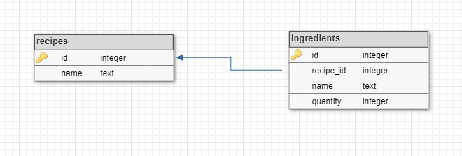

# Домашнее задание №19
## Разработать консольное приложение для хранения рецептов с помощью ORM

## Решение:
Создал классы-ENTITY, реализовал CRUD операции с помощью ORM
Внутренняя логика инкапсулировалась в классы services, внешняя логика работы программы описана в классе Worker
